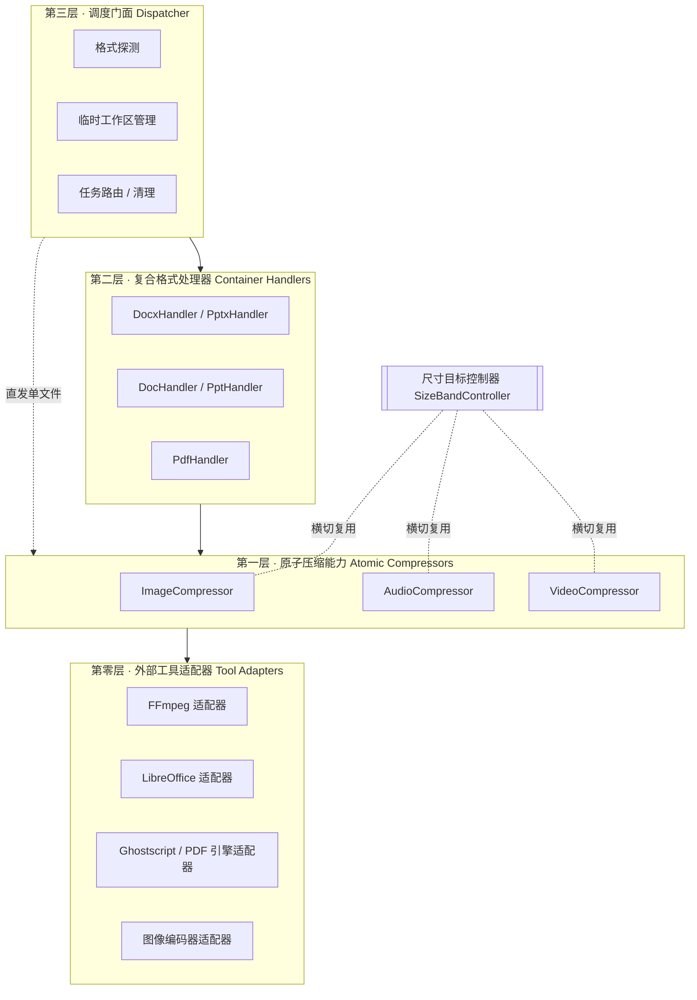
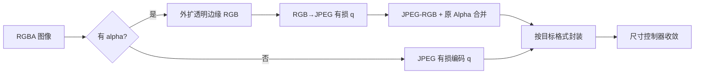
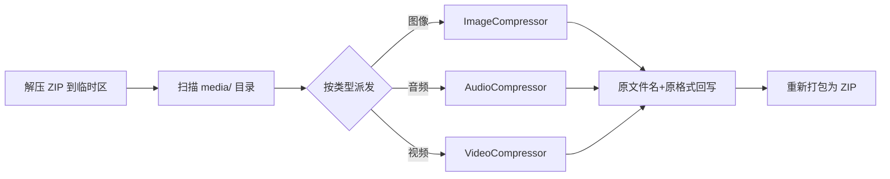
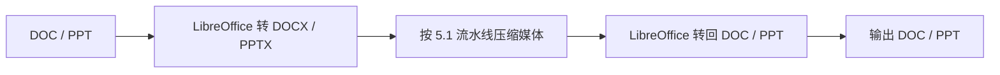
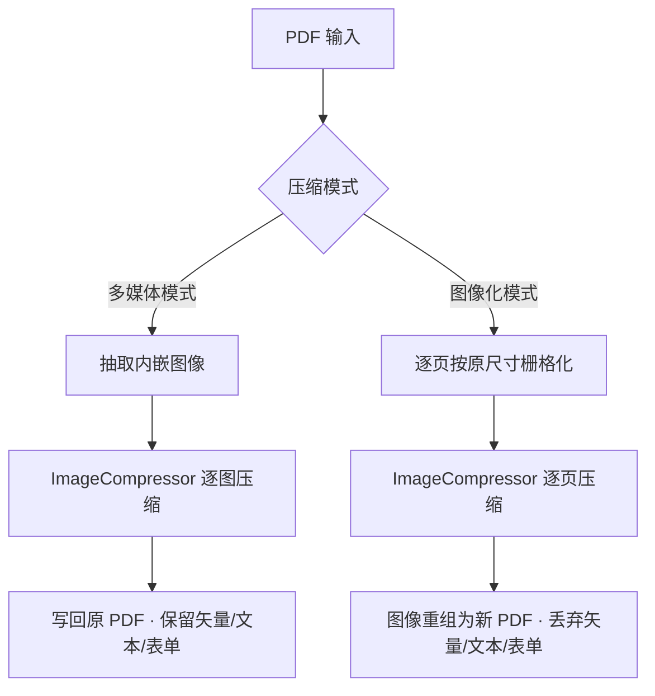
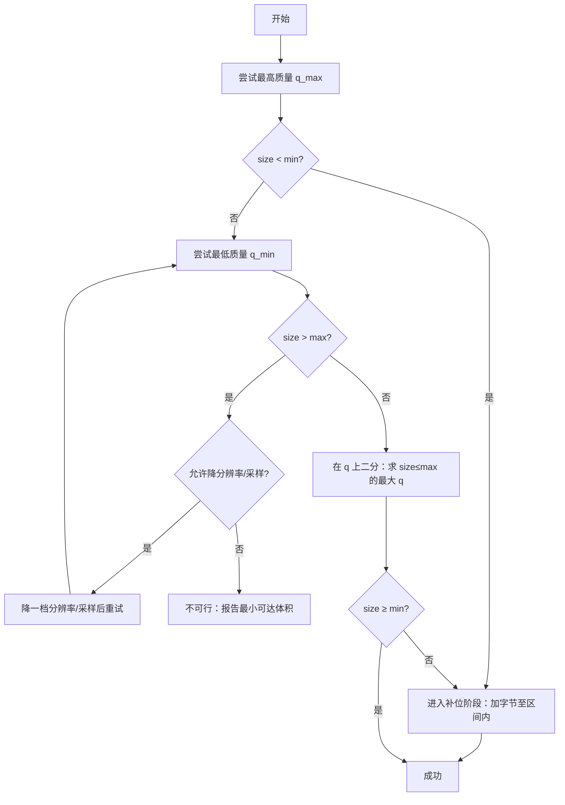

# 多格式压缩程序 · 技术设计文档（语言无关）

> 版本：v1.0（需求调研 → 概要设计）
> 适用范围：办公文档（DOC/DOCX/PPT/PPTX）、PDF、图像、音频、视频
> 目标平台：Windows 单机程序（暂不考虑 Web 与并发）
> 压缩取向：全程接受有损压缩；以**压缩率**与**精确目标大小**为第一目标，信息保真为次要目标

---

## 1. 设计原则

1. **分层与原子化**：图像、音频、视频压缩是三个"原子能力"，被所有复合格式（Office、PDF）复用，绝不重复实现。
2. **格式保真（容器层面）**：嵌入到容器内的媒体，压缩前后保持原编码格式不变（mp3 仍是 mp3、mp4 仍是 mp4、png 仍是 png），从而不破坏文档对资源的引用结构。
3. **目标可控**：支持"精确大小区间"（如 150KB ≤ size ≤ 200KB），既能向下压，也能向上补，最终落在区间内。
4. **归一化优先**：遗留专有二进制格式（DOC/PPT）先归一化为对应的 OOXML（DOCX/PPTX）再处理，处理完再转回。
5. **可失败、可回退**：任何无法满足目标的任务都返回明确的"不可行原因"，而不是产出损坏文件。

---

## 2. 总体架构

整个系统分为四层，依赖方向自上而下：



- **第零层 工具适配器**：把外部可执行程序（FFmpeg、LibreOffice/soffice、Ghostscript、pngquant 等）包装成稳定的内部调用接口，隔离命令行细节。
- **第一层 原子压缩能力**：图像 / 音频 / 视频三个压缩器，统一接口，内部调用第零层。
- **第二层 复合格式处理器**：负责"拆容器 → 派发媒体给原子能力 → 还原容器"。
- **第三层 调度门面**：对外唯一入口，做格式识别、临时目录隔离、任务编排与资源清理。
- **尺寸目标控制器（横切）**：被所有原子能力共享，负责把输出精确收敛到目标区间。

---

## 3. 公共接口与数据模型（抽象定义）

> 用伪接口描述，不绑定具体语言。

### 3.1 压缩目标模型

```text
CompressionTarget {
    mode:        ENUM { RATIO, SIZE_BAND, EXACT }   // 按比例 / 按区间 / 按精确值
    ratio:       float?          // mode=RATIO 时使用，如 0.5 表示压到一半
    min_bytes:   int?            // mode=SIZE_BAND/EXACT 时的下界
    max_bytes:   int?            // mode=SIZE_BAND/EXACT 时的上界
    allow_pad:   bool = true     // 是否允许通过"补位"满足下界 / 反向增大
    allow_downscale: bool = true // 图像/视频在压不下去时是否允许降分辨率
}
```

- `EXACT` 视为 `min == max` 的特例（实践中给一个极小容差，如 ±1KB）。

### 3.2 原子压缩器统一接口

```text
interface AtomicCompressor {
    // 输入文件路径 + 目标 → 输出文件路径 + 结果元信息
    compress(input_path, target: CompressionTarget) -> CompressionResult
    supports(media_type) -> bool
}

CompressionResult {
    output_path:   string
    final_bytes:   int
    landed_in_band: bool       // 是否落入目标区间
    operations:    list         // 实际执行的操作链（便于审计/调试）
    note:          string?      // 如"已降分辨率""已补位 N 字节"
}
```

### 3.3 复合处理器接口

```text
interface ContainerHandler {
    handle(input_path, target, options) -> output_path
    supports(file_format) -> bool
}
```

---

## 4. 原子能力详细设计

### 4.1 图像压缩（ImageCompressor）

总原则：**一律有损，优先压缩率**；唯一硬约束是——若存在 alpha 透明通道，必须保留透明通道的有效性。

按是否含 alpha 分两条路径：

**A. 无 alpha（JPG / 不透明 PNG / BMP 等）**
1. 解码为 RGB 位图。
2. 编码为 JPEG，质量参数 `q` 作为收敛旋钮（由尺寸控制器二分搜索）。
3. 若需保持原格式为 PNG（嵌入文档场景要求格式不变），则把降质后的位图重新封装为 PNG（见下文工程提示）。

**B. 含 alpha（透明 PNG 等）—— 通道分离法**
1. 拆分为 RGB 三通道 + Alpha 单通道。
2. 对透明边缘做"颜色外扩 / 去 halo"预处理：把完全透明像素的 RGB 用邻近不透明像素填充，避免 JPEG 在 alpha 边缘产生彩色溢出。
3. RGB 编码为 JPEG（有损，质量 `q` 可调）。
4. 解码 JPEG 得到降质后的 RGB，重新与原始 Alpha 通道合并为 RGBA。
5. 按目标格式封装（PNG → 仍输出 PNG）。



> **工程提示（重要权衡）**：把"已被 JPEG 降质的像素"重新无损封装回 PNG，最终体积下降有限，且对图标/截图类图反而可能变大。若允许，**强烈建议**对 PNG 改用调色板量化（pngquant 类，天然保留 alpha、压缩率高）作为首选；通道分离法仅在需要平滑渐变且必须输出 PNG 时使用。若产品允许换格式，WebP/AVIF（有损 + alpha）压缩率全面更优。本设计将"通道分离法"列为既定需求实现，将"量化法"列为可配置的更优后端。

收敛旋钮：JPEG 质量 `q ∈ [1,100]`；量化法的色板大小 / 抖动强度；必要时叠加降分辨率。

---

### 4.2 音频压缩（AudioCompressor）

- 引擎：FFmpeg（第零层适配器调用）。
- 原则：仅有损；**输出编码格式 = 输入编码格式**（mp3→mp3、aac→aac、ogg→ogg…）。
- 收敛旋钮：**比特率**（首选）/ 质量等级（如 libmp3lame 的 `-q:a`）；必要时降采样率、降声道（立体声→单声道）作为兜底。
- 每种格式选用对应编码器：mp3→libmp3lame，m4a/aac→aac，ogg→libvorbis，opus→libopus 等。

伪命令（mp3 示例）：
```text
ffmpeg -i in.mp3 -c:a libmp3lame -b:a {bitrate}k out.mp3
```

### 4.3 视频压缩（VideoCompressor）

- 引擎：FFmpeg。
- 原则：仅有损；**输出容器 = 输入容器**（mp4→mp4、mkv→mkv…）。容器不变的同时，内部编码尽量沿用与该容器兼容的编码（mp4 多用 H.264/H.265）。
- 收敛旋钮：**CRF（恒定质量因子）** 作为"恒定算法"的主旋钮；或目标码率二次编码；兜底再叠加降分辨率 / 降帧率。
- 关键澄清：**容器转换（remux）不产生压缩**，真正压缩来自重编码（transcode）。因此本设计不做"转成 mp4 压完再转回原容器"的来回换壳，而是**直接对源容器内的视频流重编码**，避免双重代际损失。

伪命令（mp4 示例）：
```text
ffmpeg -i in.mp4 -c:v libx264 -crf {crf} -c:a aac -b:a {abr}k out.mp4
```

---

## 5. 复合格式处理流水线

### 5.1 DOCX / PPTX（原生 OOXML，最简单）

OOXML 本质是 ZIP 包，媒体集中存放：DOCX 在 `word/media/`，PPTX 在 `ppt/media/`，音视频同目录。



**保持结构不变的关键**：压缩后的资源**沿用原文件名与原编码格式**回写，则 `_rels/*.rels` 关系引用与 `[Content_Types].xml` 完全无需改动——零结构变更。仅当不得不换格式（如 PNG→JPEG）时，才需同步修改：media 扩展名 + 关系 target + Content_Types 类型声明（不推荐，作为可选项）。

### 5.2 DOC / PPT（遗留二进制，需归一化）

DOC/PPT 是 OLE2 复合文档，直接二进制改写脆弱且易损坏。采用"归一化 → 处理 → 还原"：



> **风险提示**：DOC↔DOCX、PPT↔PPTX 的来回转换由 LibreOffice 完成，可能引起轻微排版/样式漂移。需在产品中提示用户，或提供"输出为 DOCX/PPTX"的更稳妥选项。
> （注：原需求中"PPT…再转回 DOC"应为笔误，正确目标是转回 **PPT**，本设计按 PPT 处理。）

### 5.3 PDF（双模式）

**模式一 · 多媒体压缩模式（保结构）**
- 遍历 PDF 内嵌图像对象，逐个交给 ImageCompressor 降采样/重编码后写回。
- 矢量图形、文本、表单、交互信息**全部保留**。
- 引擎：PDF 对象级库（提取/替换图像 XObject）或 Ghostscript 图像降采样。

**模式二 · 图像化模式（抹除矢量，体积可控）**
- 将每一页**按原尺寸渲染为单张位图**（栅格化）。
- 丢弃所有矢量、文本、表单、超链接等可交互信息。
- 对每页位图调用 ImageCompressor，再把图像重新组装成 PDF。
- 适合"只要看得见、要极致压缩、不需要可编辑/可检索"的场景。



---

## 6. 精确尺寸控制（核心算法）

需求：输出大小 `S` 必须满足 `min ≤ S ≤ max`，**既不能超，也不能少**。

核心思想：**二分搜索负责"天花板"，补位负责"地板"。**

- 压缩旋钮（JPEG 质量、视频 CRF/码率、音频码率）与输出体积近似单调，可二分。
- 二分把体积压到 `≤ max` 的最大质量点。
- 若该点体积已 `≥ min` → 直接命中区间。
- 若该点体积 `< min`（量化步进跨过了窄区间），则用**格式合法补位**把字节数精确加到落入 `[min, max]`。



要点：
- **下界总是可满足的**（只要先压到 `≤ max`），因为补位可按字节级精度增加体积。
- **唯一真正的失败模式**：最大压缩 + 最大降分辨率后体积仍 `> max` → 区间不可达，明确报错。
- 补位可达到**精确到字节**的目标大小，因此 `EXACT` 模式同样由它实现。

### 6.1 格式合法补位（Padding）目录

补位 = 向文件插入"解码器会忽略、但占用字节"的合法结构，**不改变可见内容**：

| 格式 | 补位载体 | 单元上限 | 说明 |
|---|---|---|---|
| JPEG | `COM` 注释段 / `APPn` 段 | 每段约 64KB | 大补位需串联多段 |
| PNG | 私有/辅助 chunk（小写首字母，如 `prVt`）、`tEXt`/`zTXt`/`iTXt` | 每 chunk 约 4GB | 单 chunk 即可承载大补位 |
| MP4 | `free` / `skip` box | 64-bit size，极大 | 单 box 即可 |
| MP3 | ID3v2 标签 / 其 padding 区 | 大 | 解码器忽略 |
| PDF | 未引用对象 / 注释 / 自定义流 | 大 | PDF 容忍冗余对象与尾随字节 |
| ZIP（DOCX/PPTX） | ZIP 末尾 archive comment | 约 64KB | 更大补位需加"未被引用的 part"（注意校验器可能告警） |

---

## 7. 反向"压缩"（体积增大 / 灌水）

针对问题"用户要求把 100KB 图像变成 900KB，能否通过塞入无效信息实现增大"：

**结论：完全可行，且与第 6 节的"下界补位"是同一套机制。**

- 用第 6.1 节的格式合法补位，向文件注入 +800KB 的"哑数据"。解码器忽略这些结构，**图像像素逐位不变**，肉眼内容与解码结果完全一致，仅文件体积变大。
- 对 PNG/MP4/PDF，单个结构（PNG ancillary chunk / MP4 free box / PDF 冗余对象）即可一次性灌满；对 JPEG 需串联多个 `COM` 段。
- 可**精确**控制到目标字节，因此"恰好 900KB"是可做到的。

**两点须向用户讲清的语义边界**：
1. 这是"体积灌水"，**不提升画质/信息量**。若用户真实意图是"提高清晰度"，补位无济于事——有损压缩丢失的信息无法靠补位找回。
2. 若需要"真实数据"的增大而非哑数据，可选替代：放大分辨率（插值）、转更低压缩比的封装（如 PNG→未压缩 BMP/TIFF 会带来真实的大体积跳变）。但这些不如补位精确可控。

适用的正当场景：满足上传系统的最小体积门槛、统一批量文件体积、规避基于体积的指纹等。这是标准工程手段，建议作为一个独立的 `inflate(target_bytes)` 能力，与压缩共用补位模块。

---

## 8. 异常与边界处理

- **媒体探测失败 / 损坏资源**：跳过该资源并记录，不阻断整份文档处理。
- **不可达区间**：返回最小/最大可达体积，交由上层决定是否放宽 `allow_downscale`。
- **DOC/PPT 转换漂移**：提供"保留为 OOXML 输出"的退路。
- **临时工作区**：每个任务独立临时目录，处理完无论成败都清理。
- **幂等与原子写**：先写临时输出文件，成功后再原子替换目标，避免产出半成品。

---

## 9. 推荐实现方案（具体技术选型）

> 第 1–8 节为语言无关设计；本节是落地建议。

### 9.1 语言：**Python**（首选）

理由：本系统本质是"编排外部工具 + 操作文件格式"，Python 在 PDF/图像/Office/FFmpeg 生态上最完整，开发速度最快；无并发、无 Web 的约束下，Python 的短板（GIL、性能）几乎不构成影响，真正的重活都在 FFmpeg/LibreOffice 这些原生进程里。

> 备选：若你要一个**原生 Windows 桌面 GUI**且偏好 .NET，可用 **C# / .NET（WPF 或 WinForms）**，同样 shell out 到 FFmpeg/LibreOffice，库用 Magick.NET（图像）、PdfPig/PDFium（PDF）、Open XML SDK（OOXML）。架构完全一致，只是换实现语言。

### 9.2 第三方库 / 外部工具

| 层 | 用途 | 选型 |
|---|---|---|
| 工具适配 | 音视频压缩 | **FFmpeg**（捆绑 ffmpeg.exe，子进程调用；可选 `ffmpeg-python` 封装） |
| 工具适配 | DOC↔DOCX / PPT↔PPTX | **LibreOffice**（`soffice --headless --convert-to`） |
| 工具适配 | PDF 图像降采样（可选） | **Ghostscript** |
| 原子-图像 | 通用图像处理/通道分离 | **Pillow (PIL)** |
| 原子-图像 | PNG 量化（更优后端） | **pngquant**（可执行）/ `pyfast`/`imagequant` 类绑定 |
| 复合-OOXML | ZIP 拆装 | 标准库 `zipfile`（最稳）；内容编辑可选 `python-docx` / `python-pptx` |
| 复合-PDF | 渲染/抽图/重组 | **PyMuPDF (fitz)**（栅格化、抽图、组装）+ **pikepdf**（对象级改写） |
| 打包 | 生成单文件 exe | **PyInstaller**（捆绑 ffmpeg/gs/pngquant 二进制） |

### 9.3 架构落地形态

- **单进程、分层模块**：严格对应第 2 节四层；原子能力实现统一 `AtomicCompressor` 接口。
- **尺寸控制器**作为独立模块，被三个原子能力依赖注入。
- **对外形态**：先做 **CLI**（参数：输入、模式、目标区间），跑通后再加薄 GUI（Tkinter 或 PySide6）。
- **外部二进制随程序分发**，启动时自检可用性，缺失则明确提示。
- 目录建议：
  ```text
  /core
    /adapters     (ffmpeg, libreoffice, ghostscript, image_encoder)
    /atomic       (image, audio, video)
    /handlers     (docx, pptx, doc, ppt, pdf)
    /sizing       (size_band_controller, padding)
    dispatcher.py
  /bin            (ffmpeg.exe, soffice 引用, gswin.exe, pngquant.exe)
  cli.py / gui.py
  ```

---

## 10. 需求—实现对照表

| 输入格式 | 处理路径 | 复用的原子能力 |
|---|---|---|
| DOC | →DOCX→拆包→压缩媒体→打包→DOC | 图像 / 音频 / 视频 |
| DOCX | 拆包→压缩媒体→打包 | 图像 / 音频 / 视频 |
| PPT | →PPTX→拆包→压缩媒体→打包→PPT | 图像 / 音频 / 视频 |
| PPTX | 拆包→压缩媒体→打包 | 图像 / 音频 / 视频 |
| PDF·多媒体模式 | 抽图→压缩→写回（保矢量/表单） | 图像 |
| PDF·图像化模式 | 逐页栅格化→压缩→重组 PDF | 图像 |
| 音频 | FFmpeg 有损、格式不变 | （自身为原子能力） |
| 视频 | FFmpeg 有损、容器不变 | （自身为原子能力） |
| 图像 | 有损；含 alpha 时通道分离保透明 | （自身为原子能力） |
| 任意 · 精确体积 | 二分压到 ≤max + 补位至 ≥min | 尺寸控制器 + 补位 |
| 任意 · 反向增大 | 格式合法补位灌水至目标字节 | 补位模块 |